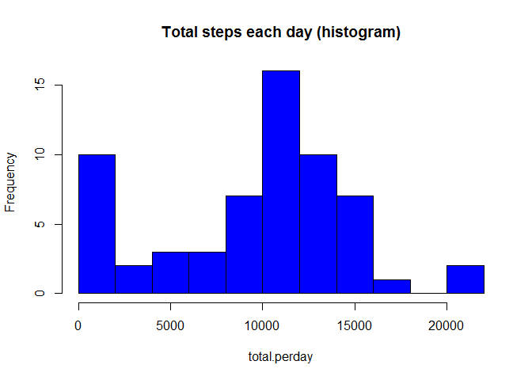
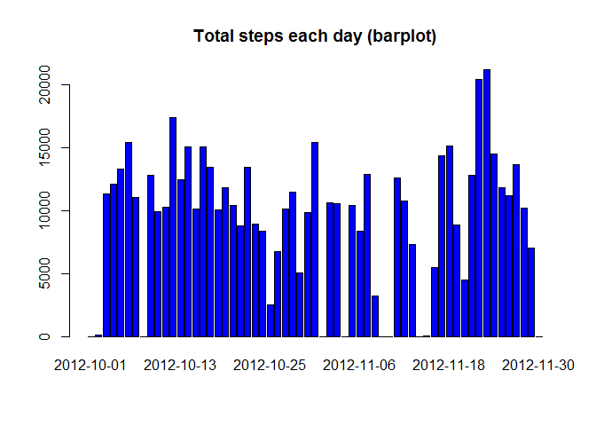
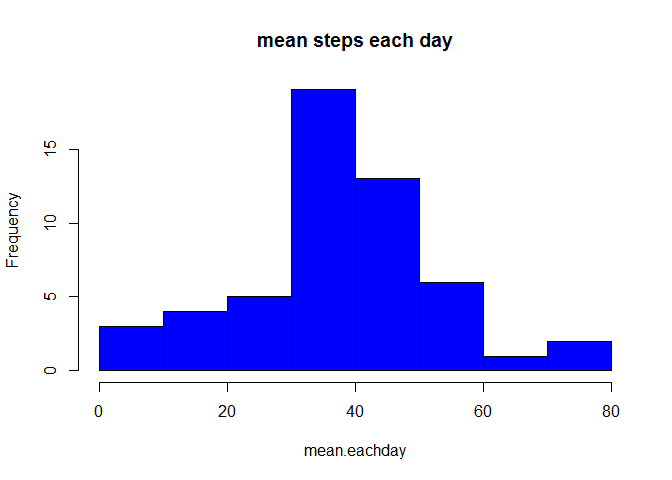
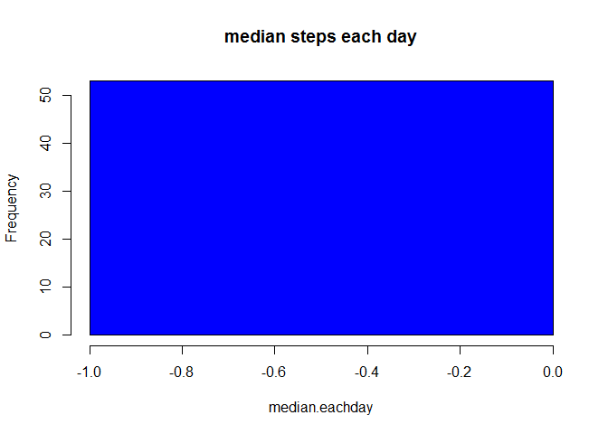
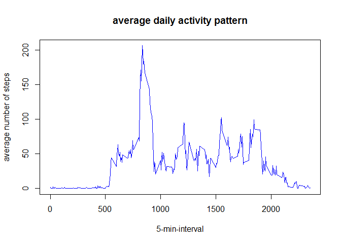
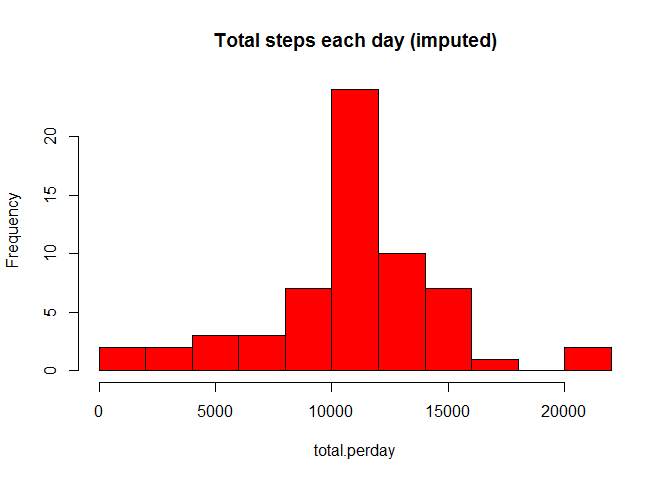
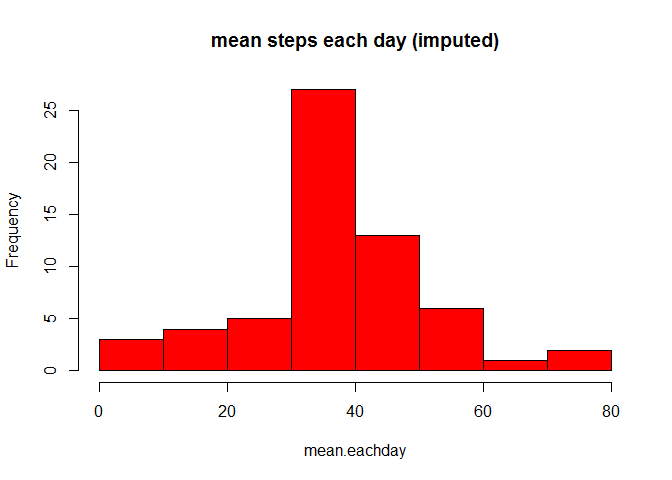
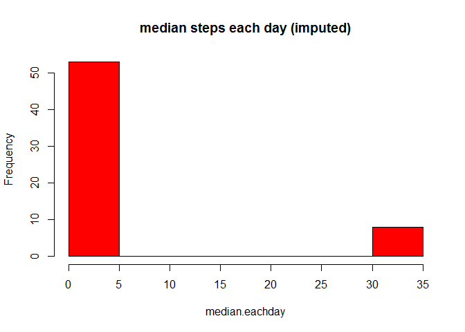
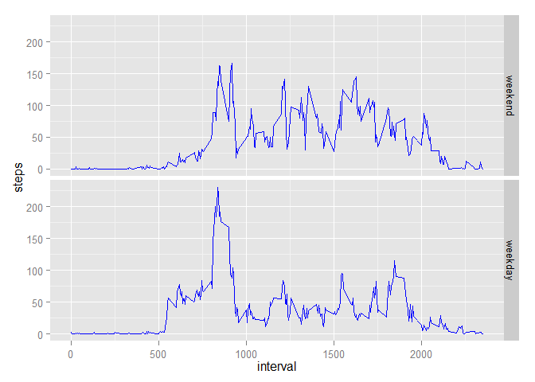

# Reproducible Research: Peer Assessment 1


## Loading and preprocessing the data

```r
#loading the data
mydata <- read.csv('C:\\Users\\Shengbing\\Documents\\R\\Reproducible_research\\assignment1\\RepData_PeerAssessment1\\activity\\activity.csv')
#remove missing values
#mydata <- mydata[complete.cases(mydata),]
```


## What is mean total number of steps taken per day?

**Both histogram and bargraph are shown below.**


```r
total.perday <- tapply(mydata$steps, mydata$date, sum, na.rm = T) #sum of steps per day
hist(total.perday, col = 'blue', breaks=15, main = 'Total steps each day (histogram)')
```

 

```r
barplot(total.perday, col = 'blue', main = 'Total steps each day (barplot)')
```

 

```r
mean.eachday <- tapply(mydata$steps, mydata$date, mean, na.rm = T)
mean.eachday
```

```
## 2012-10-01 2012-10-02 2012-10-03 2012-10-04 2012-10-05 2012-10-06 
##        NaN     0.4375    39.4167    42.0694    46.1597    53.5417 
## 2012-10-07 2012-10-08 2012-10-09 2012-10-10 2012-10-11 2012-10-12 
##    38.2465        NaN    44.4826    34.3750    35.7778    60.3542 
## 2012-10-13 2012-10-14 2012-10-15 2012-10-16 2012-10-17 2012-10-18 
##    43.1458    52.4236    35.2049    52.3750    46.7083    34.9167 
## 2012-10-19 2012-10-20 2012-10-21 2012-10-22 2012-10-23 2012-10-24 
##    41.0729    36.0938    30.6285    46.7361    30.9653    29.0104 
## 2012-10-25 2012-10-26 2012-10-27 2012-10-28 2012-10-29 2012-10-30 
##     8.6528    23.5347    35.1354    39.7847    17.4236    34.0938 
## 2012-10-31 2012-11-01 2012-11-02 2012-11-03 2012-11-04 2012-11-05 
##    53.5208        NaN    36.8056    36.7049        NaN    36.2465 
## 2012-11-06 2012-11-07 2012-11-08 2012-11-09 2012-11-10 2012-11-11 
##    28.9375    44.7326    11.1771        NaN        NaN    43.7778 
## 2012-11-12 2012-11-13 2012-11-14 2012-11-15 2012-11-16 2012-11-17 
##    37.3785    25.4722        NaN     0.1424    18.8924    49.7882 
## 2012-11-18 2012-11-19 2012-11-20 2012-11-21 2012-11-22 2012-11-23 
##    52.4653    30.6979    15.5278    44.3993    70.9271    73.5903 
## 2012-11-24 2012-11-25 2012-11-26 2012-11-27 2012-11-28 2012-11-29 
##    50.2708    41.0903    38.7569    47.3819    35.3576    24.4688 
## 2012-11-30 
##        NaN
```

```r
hist(mean.eachday, col = 'blue', main = 'mean steps each day')
```

 

```r
median.eachday <- tapply(mydata$steps, mydata$date, median, na.rm = T) #there are a lot of #zeros each day, so the median is zero
median.eachday
```

```
## 2012-10-01 2012-10-02 2012-10-03 2012-10-04 2012-10-05 2012-10-06 
##         NA          0          0          0          0          0 
## 2012-10-07 2012-10-08 2012-10-09 2012-10-10 2012-10-11 2012-10-12 
##          0         NA          0          0          0          0 
## 2012-10-13 2012-10-14 2012-10-15 2012-10-16 2012-10-17 2012-10-18 
##          0          0          0          0          0          0 
## 2012-10-19 2012-10-20 2012-10-21 2012-10-22 2012-10-23 2012-10-24 
##          0          0          0          0          0          0 
## 2012-10-25 2012-10-26 2012-10-27 2012-10-28 2012-10-29 2012-10-30 
##          0          0          0          0          0          0 
## 2012-10-31 2012-11-01 2012-11-02 2012-11-03 2012-11-04 2012-11-05 
##          0         NA          0          0         NA          0 
## 2012-11-06 2012-11-07 2012-11-08 2012-11-09 2012-11-10 2012-11-11 
##          0          0          0         NA         NA          0 
## 2012-11-12 2012-11-13 2012-11-14 2012-11-15 2012-11-16 2012-11-17 
##          0          0         NA          0          0          0 
## 2012-11-18 2012-11-19 2012-11-20 2012-11-21 2012-11-22 2012-11-23 
##          0          0          0          0          0          0 
## 2012-11-24 2012-11-25 2012-11-26 2012-11-27 2012-11-28 2012-11-29 
##          0          0          0          0          0          0 
## 2012-11-30 
##         NA
```

```r
hist(median.eachday, col = 'blue', breaks = 10, main = 'median steps each day')
```

 


## What is the average daily activity pattern?

```r
steps.each.interval <- tapply(mydata$steps, mydata$interval, mean, na.rm = T)
plot(names(steps.each.interval), steps.each.interval, type = 'l', col = 'blue', main = 'average daily activity pattern', xlab = '5-min-interval', ylab = 'average number of steps')
```

 

```r
which.max(steps.each.interval)
```

```
## 835 
## 104
```

## Imputing missing values
**Impute missing data using mean of each 5-minute interval**

*Values of total number of steps, mean and median total number of steps taken per day are different from the first part of the assignment. Imputing missing data removes a lot of zeros of the total daily number of steps.*


```r
#Calculate and report the total number of missing values in the dataset (i.e. the #total number of rows with NAs)
nrow(mydata) - sum(complete.cases(mydata))
```

```
## [1] 2304
```

```r
#fill in all of the missing values in the dataset.
imputed.data = mydata
interval.mean = tapply(imputed.data$steps, imputed.data$interval, mean, na.rm = T)
for (i in names(interval.mean)) {
        imputed.data$steps[imputed.data$interval == as.integer(i) & is.na(imputed.data$steps)]= interval.mean[i]
}
#total, mean and median of imputed data
total.perday <- tapply(imputed.data$steps, imputed.data$date, sum) #sum of steps per day
hist(total.perday, col = 'red', breaks =15, main = 'Total steps each day (imputed)')
```

 

```r
mean.eachday <- tapply(imputed.data$steps, imputed.data$date, mean)
mean.eachday
```

```
## 2012-10-01 2012-10-02 2012-10-03 2012-10-04 2012-10-05 2012-10-06 
##    37.3826     0.4375    39.4167    42.0694    46.1597    53.5417 
## 2012-10-07 2012-10-08 2012-10-09 2012-10-10 2012-10-11 2012-10-12 
##    38.2465    37.3826    44.4826    34.3750    35.7778    60.3542 
## 2012-10-13 2012-10-14 2012-10-15 2012-10-16 2012-10-17 2012-10-18 
##    43.1458    52.4236    35.2049    52.3750    46.7083    34.9167 
## 2012-10-19 2012-10-20 2012-10-21 2012-10-22 2012-10-23 2012-10-24 
##    41.0729    36.0938    30.6285    46.7361    30.9653    29.0104 
## 2012-10-25 2012-10-26 2012-10-27 2012-10-28 2012-10-29 2012-10-30 
##     8.6528    23.5347    35.1354    39.7847    17.4236    34.0938 
## 2012-10-31 2012-11-01 2012-11-02 2012-11-03 2012-11-04 2012-11-05 
##    53.5208    37.3826    36.8056    36.7049    37.3826    36.2465 
## 2012-11-06 2012-11-07 2012-11-08 2012-11-09 2012-11-10 2012-11-11 
##    28.9375    44.7326    11.1771    37.3826    37.3826    43.7778 
## 2012-11-12 2012-11-13 2012-11-14 2012-11-15 2012-11-16 2012-11-17 
##    37.3785    25.4722    37.3826     0.1424    18.8924    49.7882 
## 2012-11-18 2012-11-19 2012-11-20 2012-11-21 2012-11-22 2012-11-23 
##    52.4653    30.6979    15.5278    44.3993    70.9271    73.5903 
## 2012-11-24 2012-11-25 2012-11-26 2012-11-27 2012-11-28 2012-11-29 
##    50.2708    41.0903    38.7569    47.3819    35.3576    24.4688 
## 2012-11-30 
##    37.3826
```

```r
hist(mean.eachday, col = 'red', main = 'mean steps each day (imputed)')
```

 

```r
median.eachday <- tapply(imputed.data$steps, imputed.data$date, median) 
median.eachday  #there are still a lot of zeros
```

```
## 2012-10-01 2012-10-02 2012-10-03 2012-10-04 2012-10-05 2012-10-06 
##      34.11       0.00       0.00       0.00       0.00       0.00 
## 2012-10-07 2012-10-08 2012-10-09 2012-10-10 2012-10-11 2012-10-12 
##       0.00      34.11       0.00       0.00       0.00       0.00 
## 2012-10-13 2012-10-14 2012-10-15 2012-10-16 2012-10-17 2012-10-18 
##       0.00       0.00       0.00       0.00       0.00       0.00 
## 2012-10-19 2012-10-20 2012-10-21 2012-10-22 2012-10-23 2012-10-24 
##       0.00       0.00       0.00       0.00       0.00       0.00 
## 2012-10-25 2012-10-26 2012-10-27 2012-10-28 2012-10-29 2012-10-30 
##       0.00       0.00       0.00       0.00       0.00       0.00 
## 2012-10-31 2012-11-01 2012-11-02 2012-11-03 2012-11-04 2012-11-05 
##       0.00      34.11       0.00       0.00      34.11       0.00 
## 2012-11-06 2012-11-07 2012-11-08 2012-11-09 2012-11-10 2012-11-11 
##       0.00       0.00       0.00      34.11      34.11       0.00 
## 2012-11-12 2012-11-13 2012-11-14 2012-11-15 2012-11-16 2012-11-17 
##       0.00       0.00      34.11       0.00       0.00       0.00 
## 2012-11-18 2012-11-19 2012-11-20 2012-11-21 2012-11-22 2012-11-23 
##       0.00       0.00       0.00       0.00       0.00       0.00 
## 2012-11-24 2012-11-25 2012-11-26 2012-11-27 2012-11-28 2012-11-29 
##       0.00       0.00       0.00       0.00       0.00       0.00 
## 2012-11-30 
##      34.11
```

```r
hist(median.eachday, col = 'red', main = 'median steps each day (imputed)')
```

 


## Are there differences in activity patterns between weekdays and weekends?
**The answer is yes**
*It seems that in weekdays there is a major peak between 500 and 1000 minuts, but in weekend the activity is more spread*


```r
#install timeData package if necessary and load it
library(timeDate)
#Create a new factor variable in the dataset with two levels - "weekday" and #"weekend" 
imputed.data$isweekdays <- factor(isWeekday(as.Date(imputed.data$date), wday = 1:5), labels = c('weekend', 'weekday'))
#use ggplot2 to make a panel plot
library(ggplot2)
ggplot(data = imputed.data, aes(x = interval, y = steps)) + stat_summary(col = 'blue', fun.y = mean, geom = 'line') + facet_grid(isweekdays~.)
```

 
